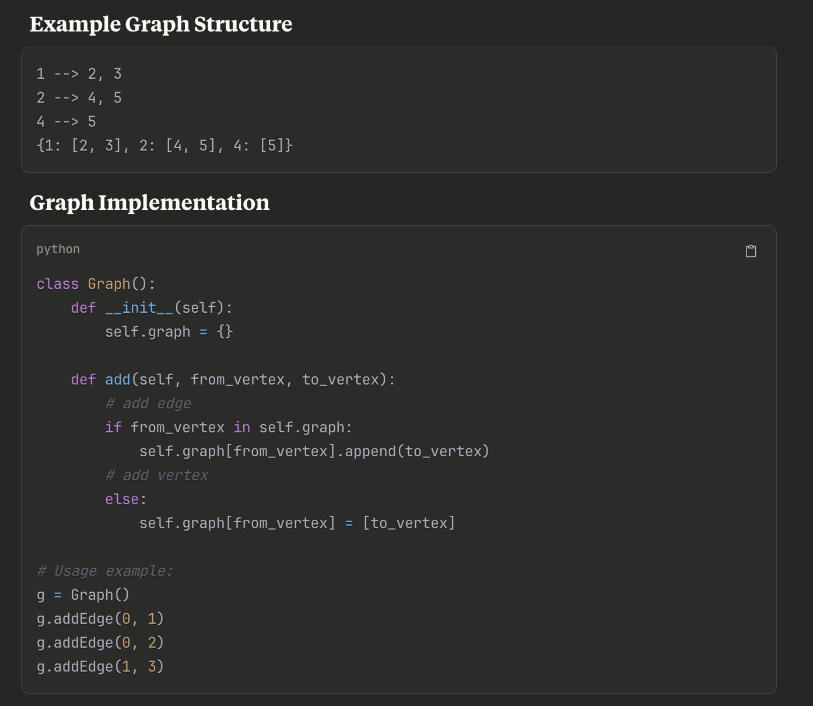
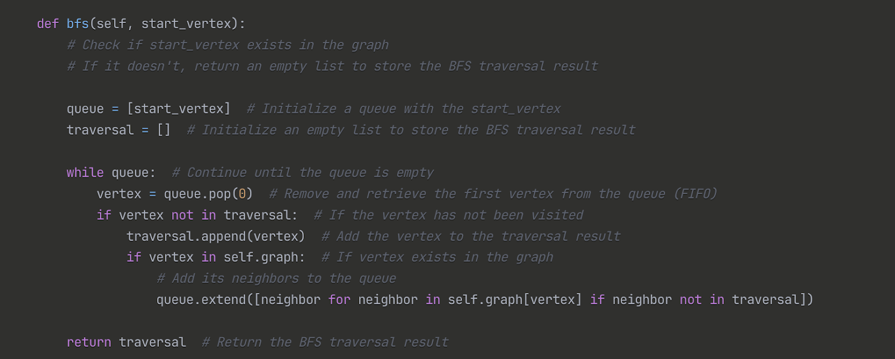
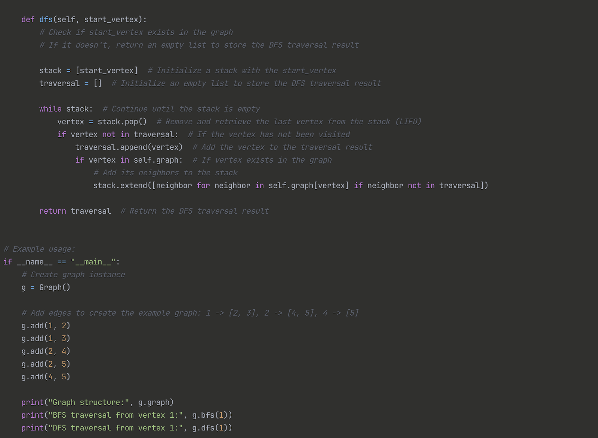

# Graph BFS and DFS Notes

## Short Notes

### Algorithm Concepts

**Graph Structure Example**
```

1 --> 2, 3
2 --> 4, 5
4 --> 5

Adjacency List Representation:
{
1: [2, 3],
2: [4, 5],
4: [5]
}

````




### Core Concepts
- **V:** Vertices  
- **E:** Edges  
- Same core idea as tree traversal  
- BFS uses a queue  
- DFS uses a stack (or recursion)  
- Each vertex is processed once  
- Each edge is processed when expanding the queue or stack  

### Complexity
- **Time Complexity:** `O(V + E)`  
  Each vertex and edge is processed once  
- **Space Complexity:** `O(V + E)`  
  Queue or stack can hold up to all vertices, and the graph itself occupies `V + E` space  

### Data Structures
- **BFS:** Queue (FIFO: First In, First Out)  
- **DFS:** Stack (LIFO: Last In, First Out)  

---

# Graphs: An Overview

A graph is a data structure consisting of a set of nodes, also called vertices, connected by edges. Graphs are used to model relationships and networks such as social networks, maps, and communication systems.

---

## Types of Graphs

### Undirected Graph
- Edges have no direction  
- Example: `a - b` means `a → b` and `b → a`

### Directed Graph (Digraph)
- Edges have direction  
- Example: `a → b`

### Weighted Graph
- Edges have associated weights or costs  
- Example: `a → b` with weight `5`

### Unweighted Graph
- Edges do not have weights  

### Cyclic and Acyclic Graphs
- **Cyclic:** Contains at least one cycle  
- **Acyclic:** Contains no cycles  
  - Examples: Trees, Directed Acyclic Graphs (DAGs)

### Connected and Disconnected Graphs
- **Connected:** A path exists between every pair of vertices  
- **Disconnected:** At least one pair of vertices has no path  

---

## Graph Representations

### Adjacency Matrix
- 2D array where `matrix[i][j]` indicates an edge from `i` to `j`
- **Space Complexity:** `O(V^2)`

### Adjacency List
- Each vertex stores a list of its neighbors
- **Space Complexity:** `O(V + E)`

### Edge List
- List of edges in the form `(u, v)` or `(u, v, weight)`

---

## Types of Graph Problems and Solutions

## 1. Traversal

### Objective
Visit all vertices in the graph.

---

### Breadth-First Search (BFS)
- Explores neighbors level by level  
- Uses a queue  
- **Time Complexity:** `O(V + E)`

```python
from collections import deque

def bfs(graph, start):
    visited = set()
    queue = deque([start])
    result = []

    while queue:
        node = queue.popleft()
        if node not in visited:
            visited.add(node)
            result.append(node)
            queue.extend(graph[node])
    return result
````

---

### Depth-First Search (DFS)

* Explores as deep as possible before backtracking
* Uses a stack or recursion
* **Time Complexity:** `O(V + E)`

```python
def dfs(graph, start, visited=None):
    if visited is None:
        visited = set()
    visited.add(start)
    for neighbor in graph[start]:
        if neighbor not in visited:
            dfs(graph, neighbor, visited)
    return visited
```

---

## 2. Shortest Path

### Objective

Find the shortest path from a source to other vertices.

---

### Dijkstra's Algorithm

* Works for weighted graphs without negative weights
* Uses a priority queue
* **Time Complexity:** `O((V + E) log V)`

```python
import heapq

def dijkstra(graph, start):
    distances = {vertex: float('inf') for vertex in graph}
    distances[start] = 0
    pq = [(0, start)]

    while pq:
        current_distance, current_vertex = heapq.heappop(pq)
        if current_distance > distances[current_vertex]:
            continue
        for neighbor, weight in graph[current_vertex]:
            distance = current_distance + weight
            if distance < distances[neighbor]:
                distances[neighbor] = distance
                heapq.heappush(pq, (distance, neighbor))
    return distances
```

---

### Bellman-Ford Algorithm

* Handles negative edge weights
* **Time Complexity:** `O(V × E)`

---

### Floyd-Warshall Algorithm

* Computes all-pairs shortest paths
* **Time Complexity:** `O(V^3)`

---

## 3. Cycle Detection

### Objective

Determine whether a graph contains a cycle.

---

### Directed Graph Cycle Detection

* Uses DFS and recursion stack

```python
def detect_cycle_directed(graph):
    def dfs(node):
        visited[node] = True
        rec_stack[node] = True
        for neighbor in graph[node]:
            if not visited[neighbor] and dfs(neighbor):
                return True
            elif rec_stack[neighbor]:
                return True
        rec_stack[node] = False
        return False

    visited = {node: False for node in graph}
    rec_stack = {node: False for node in graph}

    for node in graph:
        if not visited[node] and dfs(node):
            return True
    return False
```

---

## 4. Topological Sort

### Objective

Order vertices such that for every directed edge `(u, v)`, `u` comes before `v`.

### Approach

* DFS-based or Kahn's Algorithm (BFS-based)

```python
def topological_sort(graph):
    def dfs(node):
        visited.add(node)
        for neighbor in graph[node]:
            if neighbor not in visited:
                dfs(neighbor)
        result.append(node)

    visited = set()
    result = []
    for node in graph:
        if node not in visited:
            dfs(node)
    return result[::-1]
```

---

## 5. Connected Components

* Used in undirected graphs
* Use BFS or DFS to count components

---

## 6. Minimum Spanning Tree (MST)

### Objective

Connect all vertices with minimum total edge weight.

### Algorithms

* **Prim's Algorithm:** Priority queue based, `O((V + E) log V)`
* **Kruskal's Algorithm:** Sort edges, use Union-Find, `O(E log E)`

---

## 7. Bipartite Graph Check

* Check if graph can be colored with two colors
* Use BFS or DFS with coloring

---

## 8. Flood Fill

* Fill connected components from a starting node or cell
* Use BFS or DFS

---

## 9. Network Flow

### Objective

Find maximum flow in a flow network.

### Algorithms

* Ford-Fulkerson Method
* Edmonds-Karp Algorithm (BFS-based)

---

## Graph Problem Solving Techniques

### Representation Choice

* Adjacency list for sparse graphs
* Adjacency matrix for dense graphs

### Traversal Strategy

* BFS for shortest path in unweighted graphs
* DFS for cycles and connected components

### Dynamic Programming on Graphs

* Used for shortest paths in DAGs

### Greedy Algorithms

* Used in Dijkstra's and MST algorithms

### Backtracking

* Used in Hamiltonian paths and maze problems

---

## Tips for Graph Problems

* Identify graph type: directed, undirected, weighted, cyclic
* Draw the graph for clarity
* Handle edge cases:

  * Empty graph
  * Disconnected graph
  * Self-loops
  * Multiple edges
* Use efficient algorithms for large graphs
* Practice common patterns:

  * Traversals
  * Cycle detection
  * Shortest paths
  * Minimum spanning trees

---

Mastering these concepts equips you to solve a wide range of graph-related problems efficiently.
